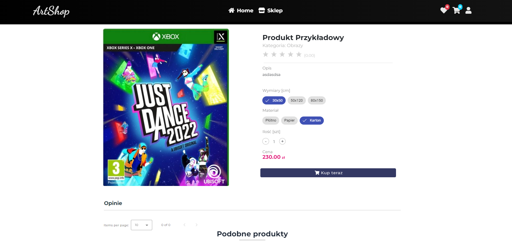

# Zaawansowane Programowanie Obiektowe - ArtShop

## Description
The internet application is a dynamic online store with built-in PayU payment processing and an intuitive administrator panel that enables easy content and order management.

Key features of the application:

- Online Store: The application allows users to browse and purchase products online.

- PayU Payments: Users can make payments for their purchases using the PayU payment platform. (simulation)

- Search and Filters: The application offers a search and filtering function to help users find products that meet their needs.

- Shopping Cart: Users can add products to their shopping cart and then complete their orders and make payments.

- User Account: It allows users to create an account.

- Administrator Panel: For store owners, there is an administrator panel available that enables the management of products, categories, prices, and order monitoring.

- Content Management: The administrator can add, edit, and delete content on the website, such as product descriptions, images, promotions, and manage user comments.

- Responsive Design: The website is responsive, meaning it adapts to different screen sizes.

## Technologies

- **Frontend:**
    - Framework: Angular 16+

- **Backend:**
    - Programming Language: Java 21
    - Framework: SpringBoot 3.1.1
    - Database: MySql

## Features

- **CRUD Operations:**
    - Create, Read, Update, and Delete operations using the Generic Repository Pattern.

- **User Interface:**
    - Utilize Angular to create a responsive and aesthetically pleasing user interface.

- **Authentication and Authorization:**
    - Implement authentication and authorization mechanisms using JWT.

- **API Communication:**
    - Use RESTful API for communication between the frontend and backend.
  
- **Payment:**
    - Use PayU (Sandbox) for simulating payments.

## Project Structure

- **Backend:**
  - `/config`: Server configuration files.
  - `/controllers`: Request handling controllers.
  - `/dtos`: Data transfer objects.
  - `/entities`: Data models or tables.
  - `/exceptions`: Custom error handling.
  - `/mappers`: Data conversion tools.
  - `/repositories`: Database interaction classes.
  - `/services`: Business logic implementation.

- **Frontend:**
    - `/src`: Angular source code

## Requirements

- Node.js 20.9.0 (x64) and npm
- Ngrok (is needed for exposing local servers to the internet - payment)

## Running Instructions
1. Clone the repository: `git clone [REPOSITORY_URL]`
2. Run the backend: `./mvnw spring-boot:run`
3. Install dependencies: `npm install`
4. Run the frontend: `ng serve`

## Screenshots

## Authors
- Rafał Kisłowski
- Karolina Auchimik

